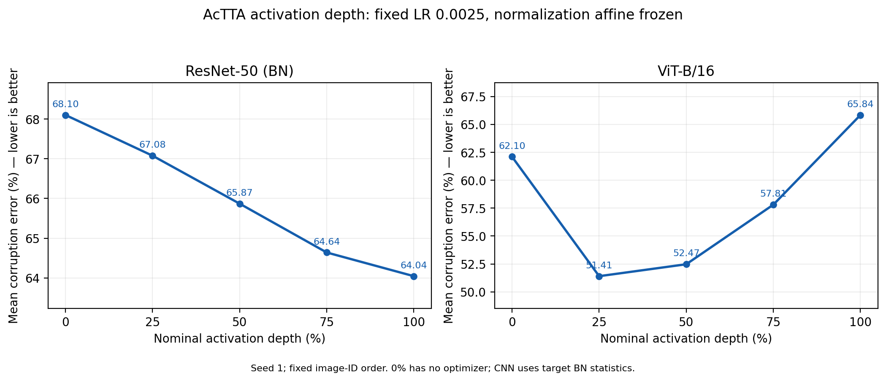

# Measured results and comparison with the paper

Errors are percentages; lower is better. ImageNet-C results use seed 1 and
batch 128; paper values are three-seed means. CIFAR-10-C TENT/AcTTA results
are means over seeds 1, 2, and 3; other CIFAR rows use seed 1.

## Ordered ImageNet-C depth sweep

This is the original depth runner's **fixed image-ID file order** (`shuffle=False`),
all 15 severity-5 corruptions × 5,000 images, fixed SGD LR 0.0025, momentum 0.9,
Nesterov=True, one entropy step, and frozen normalization affine values.
Model and optimizer reset per corruption. Only selected activation vectors
are optimized; zero depth constructs no optimizer. RN50 zero still uses
batch BN statistics, rather than checkpoint running statistics.

The paper's [Table 4](https://arxiv.org/html/2603.26096v1#S4.T4) starts at
approximately 10%; 0% is an additional baseline.
Exact first-layer counts and architecture details are in [ARCHITECTURE.md](ARCHITECTURE.md).

| Depth | RN50 measured | Paper Table 4 | Delta (pp) | ViT measured | Paper Table 4 | Delta (pp) |
|---|---:|---:|---:|---:|---:|---:|
| 0% | 68.1027 | — | — | 62.1040 | — | — |
| 25% | 67.0773 | 67.02 | +0.0573 | 51.4067 | 51.40 | +0.0067 |
| 50% | 65.8693 | 65.89 | -0.0207 | 52.4747 | 52.47 | +0.0047 |
| 75% | 64.6400 | 63.45 | +1.1900 | 57.8107 | 57.81 | +0.0007 |
| 100% | 64.0440 | 63.47 | +0.5740 | 65.8427 | 65.84 | +0.0027 |

Files: [raw runs](../results/depth_sweep_runs/),
[summary CSV](../results/depth_sweep_summary.csv),
[complete selected-layer manifest](../results/depth_sweep_layer_manifest.csv),
[per-corruption results](../results/depth_sweep_per_corruption.csv).

## ImageNet-C architecture and settings comparisons

These configurations use the **shuffled stream** (`shuffle=True`),
with all 15 severity-5 corruptions × 5,000 images. Paper values are from
[Table 5](https://arxiv.org/html/2603.26096v1#S4.T5).

All variants below use momentum 0.9, no dampening/weight decay, and shift resets.
Nesterov=True unless explicitly labeled standard SGD. Source has no optimizer.
The executable commands are in `scripts/reproduce_architecture_audit.sh`;
raw JSONs contain each exact resolved config.

| Run setting | Error (%) | Main Table 5 | Delta (pp) |
|---|---:|---:|---:|
| RN50 TENT, LR 0.00025 | 66.6027 | 66.50 | +0.1027 |
| RN50 AcTTA, 25 calls, LR 0.0025, frozen BN affine | 65.8760 | 64.95 | +0.9260 |
| RN50 AcTTA, legacy 17 residual-output modules, LR 0.005 | 65.0400 | 64.95 | +0.0900 |
| ViT Source | 62.1040 | 62.10 | +0.0040 |
| ViT TENT, LR 0.001 | 53.4987 | 53.85 | -0.3513 |
| ViT AcTTA, 6 blocks + all LN, LR 0.001, tanh GELU | 49.0547 | 51.79 | -2.7353 |
| ViT AcTTA, 6 blocks, frozen LN, LR 0.0025, tanh GELU | 50.1173 | 51.79 | -1.6727 |
| ViT AcTTA, 6 blocks + all LN, LR 0.001, exact GELU | 48.9773 | 51.79 | -2.8127 |
| RN50 AcTTA, 25 calls, LR 0.005, frozen BN affine | 64.3213 | 64.95 | -0.6287 |
| ViT TENT, LR 0.001, standard SGD | 53.8227 | 53.85 | -0.0273 |
| ViT AcTTA, 6 blocks + all LN, LR 0.001, exact GELU, standard SGD | 49.8147 | 51.79 | -1.9753 |
| ViT AcTTA, 6 blocks + all LN, LR 0.00025, tanh GELU | 53.4707 | 51.79 | +1.6807 |

The depth comparison uses the ordered, normalization-frozen profile above.
The 17-module residual-output selection is described in
[the architecture notes](ARCHITECTURE.md#resnet-50-independent-relu-call-sites).

Files: [raw runs](../results/architecture_runs/),
[summary CSV](../results/architecture_audit_summary.csv),
[field-by-field paper settings comparison](../results/architecture_paper_config_comparison.csv),
[layer manifest](../results/architecture_layer_manifest.csv),
[per-corruption results](../results/architecture_per_corruption.csv).

## CIFAR-C

Each full run covers all 15 severity-5 corruptions × 10,000 images with the
original shuffled stream and shift resets. Models: WRN-28-10 on CIFAR-10-C,
WRN-40-2 on CIFAR-100-C. Adam LR is 0.001/0.01 for TENT/AcTTA at BS128;
BS4 rates are one tenth. AcTTA freezes BN affine values but uses batch statistics.
WRN28 adapts `block1`; WRN40 adapts `block1` and `block2`.

| Dataset / batch | Method | Seeds | Error (%) | Paper error (%) | Delta (pp) |
|---|---|---|---:|---:|---:|
| CIFAR-10-C / BS128 | Source | 1 | 43.5167 | 43.52 | -0.0033 |
| CIFAR-10-C / BS128 | TENT | 1, 2, 3 | 18.4276 | 18.51 | -0.0824 |
| CIFAR-10-C / BS128 | AcTTA-TENT | 1, 2, 3 | 17.0322 | 17.03 | +0.0022 |
| CIFAR-100-C / BS128 | Source | 1 | 46.7480 | 46.75 | -0.0020 |
| CIFAR-100-C / BS128 | TENT | 1 | 35.4367 | 35.25 | +0.1867 |
| CIFAR-100-C / BS128 | AcTTA-TENT | 1 | 33.9793 | 33.81 | +0.1693 |
| CIFAR-100-C / BS4 | TENT | 1 | 57.1500 | 57.35 | -0.2000 |
| CIFAR-100-C / BS4 | AcTTA-TENT | 1 | 54.8673 | 55.03 | -0.1627 |

CIFAR-10-C population/sample SDs are 0.06458/0.07910% for AcTTA-TENT and
0.08806/0.10785% for TENT.

Files: [raw runs](../results/gpu2_runs/),
[summary CSV](../results/gpu2_reproduction_summary.csv),
[per-corruption errors](../results/gpu2_per_corruption.csv),
[paired improvements](../results/gpu2_paired_improvements.csv).

## Additional ResNet-50 configurations

These configurations use the torchvision V1 checkpoint, BS128, seed 1,
all 15 severity-5 corruptions × 5,000 images, and the shuffled stream.
The residual-output configuration uses SGD momentum 0.9 with
**Nesterov=False**, TENT LR 0.00025, and AcTTA LR 0.005. AcTTA selects the
stem plus sixteen residual-output ReLUs. Source uses stored BN statistics
and no optimizer.

| RN50 setting | Error (%) |
|---|---:|
| Source | 82.0213 |
| TENT, standard SGD | 66.6693 |
| AcTTA, legacy 17-module selection, standard SGD | 65.1493 |

The shuffled RN50 depth profile uses `shuffle=True`, LR 0.0025,
Nesterov=True, and frozen BN affine values. Selected call counts are
0/13/25/38/49.

| Shuffled RN50 depth | Error (%) |
|---|---:|
| 0% | 68.1200 |
| 25% | 67.0813 |
| 50% | 65.8760 |
| 75% | 64.6653 |
| 100% | 64.1520 |

Files: [residual-output configuration runs](../results/imagenet_runs/),
[shuffled depth runs](../results/depth_sweep_shuffled_pilot_runs/),
and [summary CSV](../results/historical_results.csv).
